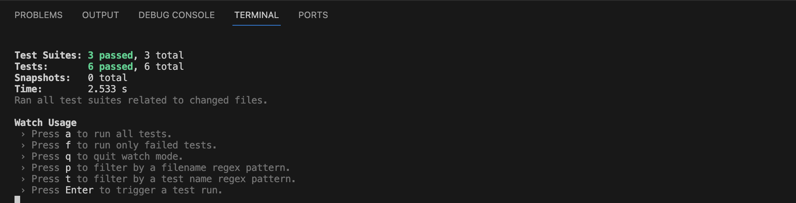
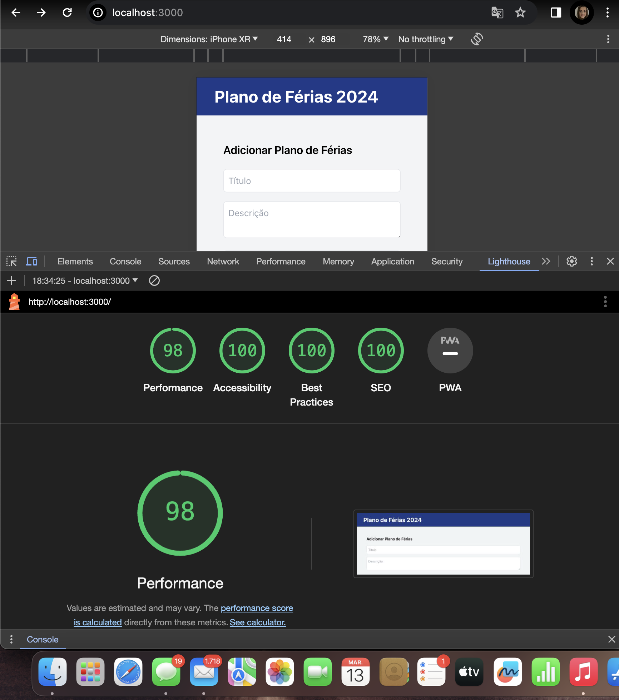

# Holiday Plans Manager 2024 🏖️

This is a web application project for managing holiday plans for the year 2024. It allows you to add, view, edit, and delete holiday plans, as well as print the details in PDF format.

## Features ✨

- Add new holiday plans.
- View all existing holiday plans.
- Edit existing holiday plans.
- Delete existing holiday plans.
- Print holiday plan details in PDF format.

## Installation and Usage ⚙️

1. Clone this repository:

   ```bash
   git clone https://github.com/your-username/holiday-plans-manager.git
    ```
2. Navigate to the project directory:
    cd holiday-plans-manager

3. Install dependencies:
npm install

4. Start the development server:
npm start

## Testing 🧪

After starting the development server, you can run the project tests with the following command: 
 - npm test





## Performance 🚀
To ensure the quality and performance of the application, audits were conducted using Google Chrome's Lighthouse. Below are the results obtained:


